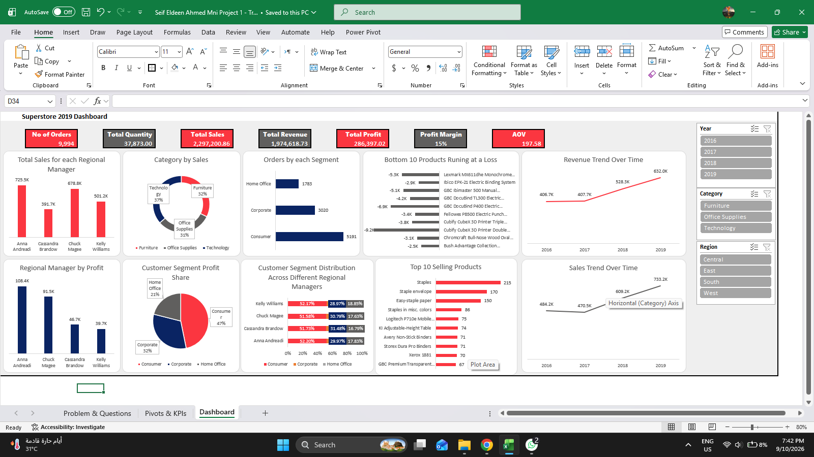

# Superstore Sales Analysis

## Project Overview

This project focuses on analyzing Superstore sales data using Microsoft Excel to identify sales trends, evaluate business performance, and generate meaningful insights from the dataset.

The analysis covers different aspects of sales performance, including products, customers, regions, and time-based trends.

## Tools Used

- Microsoft Excel
- Data Cleaning
- Data Analysis
- Pivot Tables
- Charts & Visualizations
- Dashboard Design

## Objectives

The main objectives of this project are:

- Analyze overall sales performance.
- Identify sales trends over time.
- Compare performance across different regions.
- Analyze product and category performance.
- Understand customer and segment performance.
- Identify the factors contributing to sales and profit performance.
- Present the results through an interactive Excel dashboard.

## Data Analysis

The analysis includes:

- Sales performance analysis
- Profit analysis
- Quantity analysis
- Regional performance
- Category and product analysis
- Customer segment analysis
- Time-based sales trends
- Comparison of business performance across different dimensions

## Dashboard

The project includes an Excel dashboard designed to present the main findings and provide a clear overview of the sales performance.

### Dashboard Preview

## Key Insights

The analysis was used to identify:

- The best-performing regions and categories.
- Sales trends across different time periods.
- The products and segments contributing most to overall performance.
- Differences in sales and profit performance across business dimensions.
- Areas with relatively stronger or weaker performance.

## Project Files

- `Superstore-Sales.xlsx` — Original Excel analysis file.
- `images/` — Dashboard screenshots and project visuals.

## Conclusion

This project demonstrates the use of Microsoft Excel for data cleaning, exploratory analysis, visualization, and dashboard development.

It also highlights how sales data can be transformed into meaningful business insights through structured analysis and visualization.
